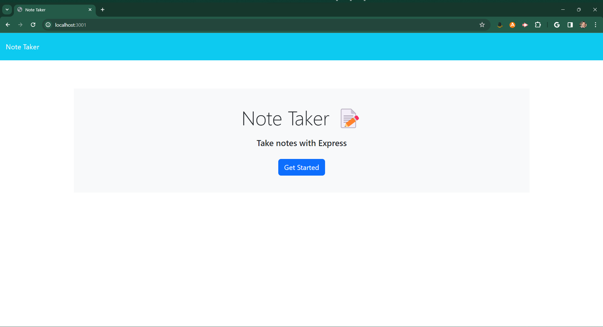
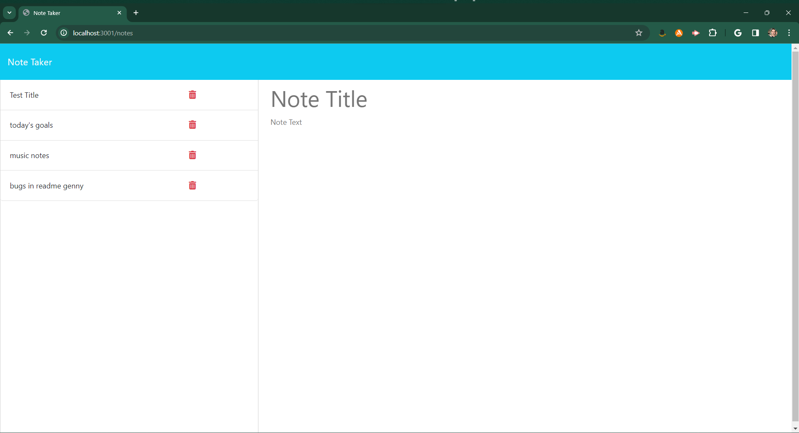
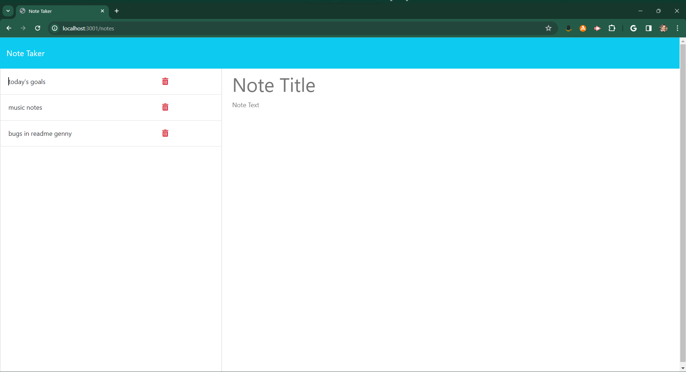

# Note-Smith
<svg xmlns="http://www.w3.org/2000/svg" xmlns:xlink="http://www.w3.org/1999/xlink" width="128" height="20" role="img" aria-label="license:: MIT License"><title>license:: MIT License</title><linearGradient id="s" x2="0" y2="100%"><stop offset="0" stop-color="#bbb" stop-opacity=".1"/><stop offset="1" stop-opacity=".1"/></linearGradient><clipPath id="r"><rect width="128" height="20" rx="3" fill="#fff"/></clipPath><g clip-path="url(#r)"><rect width="53" height="20" fill="#555"/><rect x="53" width="75" height="20" fill="#008080"/><rect width="128" height="20" fill="url(#s)"/></g><g fill="#fff" text-anchor="middle" font-family="Verdana,Geneva,DejaVu Sans,sans-serif" text-rendering="geometricPrecision" font-size="110"><text aria-hidden="true" x="275" y="150" fill="#010101" fill-opacity=".3" transform="scale(.1)" textLength="430">license:</text><text x="275" y="140" transform="scale(.1)" fill="#fff" textLength="430">license:</text><text aria-hidden="true" x="895" y="150" fill="#010101" fill-opacity=".3" transform="scale(.1)" textLength="650">MIT License</text><text x="895" y="140" transform="scale(.1)" fill="#fff" textLength="650">MIT License</text></g></svg>

a note taking app

## Description
an application that allows the user to read, write, save, and delete notes

## Table of Contents

- [Installation](#installation)
- [Usage](#usage)
- [License](#license)
- [Acknowledgements](#acknowledgements)
- [Further-Development](#further-development)
- [Author](#author)
- [Contact](#contact)
- [Final-Thoughts](#final-thoughts)

## Installation

## Usage
Click on the "Get Started" button to open up the notes interface. Clicking in the title or note text areas will bring up the "save note", and "new note" buttons. After a note has been created, it can be deleted by clicking on the trash can icon next to it on the left side of the application. Clicking on a note title will open it on the right side of the application. Clicking on the "New Note" button allows for creation of a new note. 

[link-to-deployed-application](https://warm-depths-06907-3d967eb40a9a.herokuapp.com/)

## License
See the License file for license information.

## Acknowledgements
This application utilizes the following packages along with chatgpt as a debugging tool:

- [https://expressjs.com/](Express.js)
- [https://www.npmjs.com/package/uuid](uuid)

## Further Development
If I choose to return to this app or if someone wishes to add to it, I'd like to see the following added:

- [x] increase the size of the note-text area field in order to easily view larger notes
- [] Add an edit feature (paths are ready to be made)

## Author

- Ashley Maximillian
- [e6m9 on github](https://github.com/e6m9)

## Contact
For any inquiries, please send yr emails to:

- alostsound@gmail.com

## Final Thoughts
I'm a very busy person and I love making to-do lists and jotting down reminders. This was a fun project and I'm excited to use it in a practical setting.